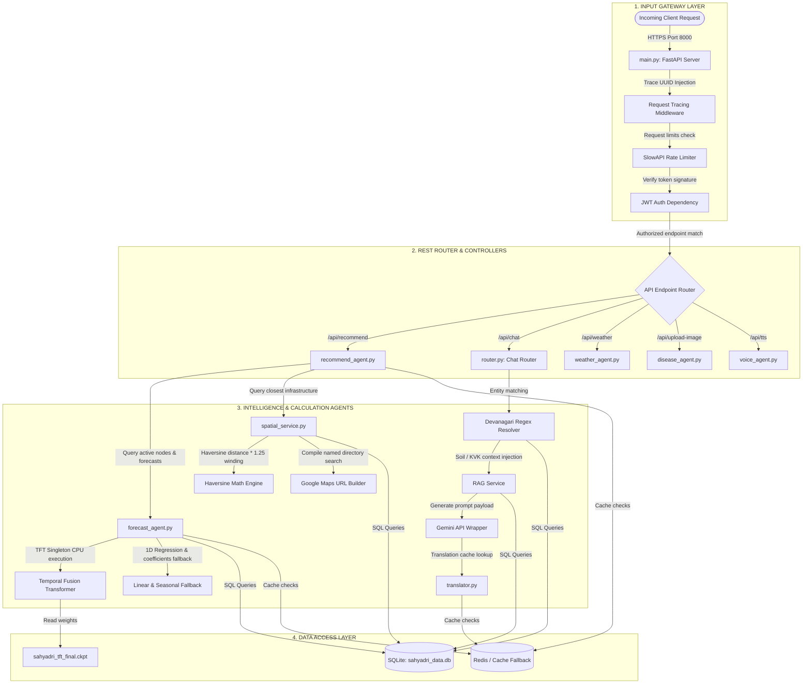

# Project Sahyadri 2.0: Backend Server Architecture

This document details the architecture, orchestration layers, database relations, and service integrations of the **Project Sahyadri 2.0 Backend Server**. The backend is designed on a modular, decoupled agent-based model using FastAPI to handle REST APIs, local AI inference, spatial calculations, and security validation.

---

## 1. Backend Orchestration Flowchart

The native Mermaid diagram below maps the internal component layers, showing how a request travels through the backend services:

---

## 2. Component Breakdowns

### 2.1 The Request Ingestion Gateway (`main.py`)
All REST endpoints are managed by [main.py](file:///c:/Users/Shashank/OneDrive/Desktop/data_sets_fetched/market_and_transaction_data/backend/app/main.py):
* **Custom Middleware:**
  * Generates a unique UUID and inserts it into the HTTP headers as `X-Request-ID` for end-to-end request tracing.
  * Injects a process execution timer returning `X-Process-Time` to trace response latency.
  * Disguises the host framework by overriding the `Server` header to `"Sahyadri Secure Shield"`.
  * Masks tracebacks in production, returning a generic error page to prevent exposure of code internals.
* **Access Control:** Enforces rate-limiting buckets (SlowAPI backed by Redis) and parses JWT tokens (`get_current_user` auth dependency) on state-modifying requests.

### 2.2 The Forecast Agent (`forecast_agent.py`)
Handles target price predictions:
* **Lookup Resolution:** Maps input aliases to database columns and pulls the last 12 weeks of trade data for matching mandi nodes.
* **TFT CPU Execution:** Coordinates the singleton PyTorch model. Because the weights are GPU-trained, the agent intercept-patches the checkpoint variables onto the CPU on startup and sets thread concurrency to 1 to protect the host's memory from thrashing.
* **Heuristics Solver:** Calculates forecasts using a 1D linear regression trend combined with monthly seasonal harvest coefficients when lookback steps are insufficient.

### 2.3 The Recommendation Agent (`recommend_agent.py`)
Executes the logistics and financial optimization model:
1. **Quantity-Based Transport Selector:** Maps the load size (quintals) to specific vehicle capacities and mileages (e.g. Mini Pickup, Medium Truck, Heavy Trucks) to estimate fuel consumption.
2. **Logistics Costing:** Computes the total logistics trip:
   $$\text{Diesel Cost} = \left( \frac{\text{Distance}}{\text{Mileage}} \right) \times \text{Diesel Price (₹95.00/L)} \times N_{\text{trucks}}$$
   $$\text{Logistics Cost} = \text{Diesel Cost} + \text{Tolls} + \text{Base Handling Fee (₹500.00)}$$
3. **Mandi Fees:** Adds source-type specific tolls and mandi fees (APMC: ₹45/qtl; Private: ₹20/qtl + ₹50 toll; Corporate: ₹0 mandi fee + ₹90 toll).
4. **Holding Cost Math:** Computes storage rent and bank interest fees:
   $$\text{Rent}_D = Q \times \text{Warehouse Rent Rate} \times \left( \frac{D}{30} \right)$$
   $$\text{Interest}_D = \text{Spot Price} \times Q \times \text{Bank LTV Rate} \times \text{Cooperative Interest Rate} \times \left( \frac{D}{365} \right)$$
5. **Optimizer:** Ranks the nodes by net payout, selecting `HOLD` if holding yields an extra profit gain of at least **₹1,000** over immediate selling.

### 2.4 The Spatial & Routing Service (`spatial_service.py`)
* **Coordinates Mapping:** Reads coordinates from [location_coords.json](file:///c:/Users/Shashank/OneDrive/Desktop/data_sets_fetched/market_and_transaction_data/location_coords.json).
* **Distance Solver:** Calculates straight-line distance via the **Haversine formula**, applying a circuity factor of **1.25** to estimate actual road driving distance.
* **Google Maps Router:** Dynamically compiles URL strings using named business listings to ensure routes point to physical facilities.

### 2.5 The Chat Router & Multilingual Chatbot Agent (`router.py`)
Orchestrates natural language conversations:
* **Regex Alias Resolvers:** Implements multilingual regular expressions to isolate names, crops, and districts from query strings in English, Hindi, and Marathi.
* **Context Assembly:** Queries spatial datasets (soil parameters, local KVK numbers, MSWC warehouse spaces, and DCCB loan criteria) based on extracted entities.
* **Generative Pipeline:** Injects the gathered context into custom system prompts, sends them to the Gemini API, and passes responses through a local translation cache (`translated_cache.json`) to minimize latency.
