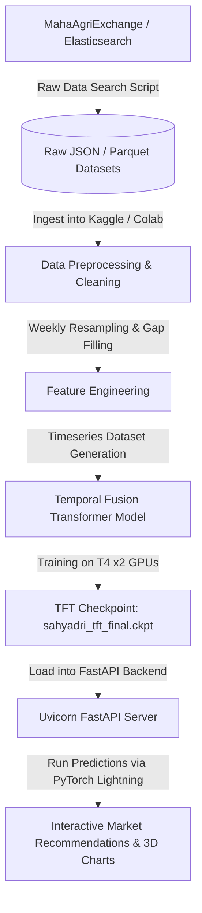

# Project Sahyadri 2.0: Data Ingestion & TFT Model Training Pipeline

This document details the pipeline used to fetch raw agricultural transaction and infrastructure data, preprocess it, engineer temporal features, and train the deep learning **Temporal Fusion Transformer (TFT)** model using GPU acceleration.

---

## 1. System Architecture Flow

The following diagram illustrates the workflow from raw data ingestion to generating price forecasts for the Sahyadri platform:



---

## 2. Step-by-Step Pipeline Explanation

### Step 2.1: Data Ingestion via Elasticsearch Script
* **Ingestion Source:** Raw data is fetched from the central **MahaAgriExchange (MahaAgX)** portal.
* **Mechanism:** An Elasticsearch query script retrieves raw transactional documents:
  * **Daily APMC transactions** (modal rates, arrivals).
  * **Private market arrivals** (receipt quantities, prices).
  * **Agro-industrial direct transactions** (corporate procurement records).
  * **Warehouse coordinates and storage capacity** details.
* **Storage Format:** Saved as unified datasets, including a compressed `sahyadri_dataset.parquet` file (over 31 lakh rows) for storage efficiency and rapid I/O during machine learning training.

### Step 2.2: Data Cleaning & Preprocessing
To prepare the raw datasets for deep learning, the training script [sahyadri_colab_training.py](file:///c:/Users/Shashank/OneDrive/Desktop/data_sets_fetched/market_and_transaction_data/sahyadri_colab_training.py) executes the following data cleaning operations:
1. **Datetime Parsing:** Converts variable-format date columns into standard Pandas `datetime64[ns]` objects.
2. **Numeric Coercion:** Coerces price points (`modal_price`, `min_price`, `max_price`) and volume details (`quantity`) to float datatypes, handling corrupt/invalid string representations.
3. **Invalid Price Filtering:** Drops entries with missing target prices or price outliers (e.g., records where `modal_price <= 100` INR/qtl), removing erroneous records and non-transaction entries.
4. **Categorical Stabilization:** Conversions to raw strings are executed on spatial and identity variables (`commodity`, `district`, `source_type`, `market_name`) to avoid indexing bugs during subsequent resampling groups.

### Step 2.3: Weekly Resampling & Sequence Alignment
Traditional time-series models fail when sequences contain gaps (e.g., mandis closed on holidays). The Temporal Fusion Transformer requires continuous, equally spaced time steps.
1. **Date Rounding:** Dates are rounded to the Sunday of their respective weeks:
   $$\text{week\_date} = \text{date} + ((6 - \text{weekday}) \bmod 7)\text{ days}$$
2. **Intermediate Aggregation:** Collapses daily records to weekly averages to compress the 3 million+ rows and prevent out-of-memory crashes on Kaggle:
   * `modal_price` $\rightarrow$ Mean value of the week.
   * `min_price` $\rightarrow$ Minimum value observed in the week.
   * `max_price` $\rightarrow$ Maximum value observed in the week.
   * `quantity` $\rightarrow$ Sum of arrivals during the week.
3. **Gap Filling:** Performs a forward-fill (`ffill`) on empty weeks so that if a commodity isn't traded during a particular week, it retains the last known price.
4. **Zero-Filling Quantity:** Fills quantity gaps with `0.0` (indicating zero trade occurred that week).
5. **Length Filtering:** Removes short histories; series must have at least **15 consecutive weeks** of transaction data to be eligible for training.
6. **Continuous Time Index:** Creates a continuous integer index `time_idx` (representing the number of elapsed weeks since the base dataset date) to align all series.

### Step 2.4: Feature Engineering
To enable the TFT model to learn complex, multi-modal relationships, the data is partitioned into distinct feature groups:
* **Static Categoricals (Entity Embeddings):** Columns that do not change over time but represent entity context:
  * `commodity` (e.g., Soyabean, Cotton, Wheat)
  * `district` (e.g., Latur, Nanded, Washim)
  * `market_name` (Specific Mandi or Buyer Name)
  * `source_type` (APMC, Private Market, or Direct Corporate Buyer)
* **Time-Varying Known Categoricals:** Future-available categorical variables:
  * `month` (1-12, represented as a category for learning annual cyclical seasonality).
* **Time-Varying Known Reals:** Future-available numerical variables:
  * `time_idx` (Linear timeline index).
* **Time-Varying Unknown Reals:** Historical variables only known up to the present moment:
  * `modal_price` (Target variable).
  * `quantity` (Trade volume).
  * `volatility_4w` (Rolling 4-week standard deviation of prices, acting as a historical volatility signal).

---

## 3. The Temporal Fusion Transformer (TFT) Model

### What is a Temporal Fusion Transformer?
The **Temporal Fusion Transformer (TFT)** is an attention-based deep learning architecture developed by Google, specifically optimized for multi-horizon time-series forecasting. Unlike general-purpose transformers, TFT is engineered to handle heterogeneous data sources (static metadata, known future variables, and historical time-varying inputs) while maintaining high interpretability.

```
                  +-----------------------------------------+
                  |         Static Entity Embeddings        |
                  |     (Commodity, District, Market)      |
                  +--------------------+--------------------+
                                       | (Static Context)
                                       v
+-----------------------+     +------------------+     +------------------------+
| Historical Features   | --> | Variable Select  | --> | Temporal LSTM Layer    |
| (Past Price, Volumne) |     | Networks (VSN)   |     | (Local Trend Modeling) |
+-----------------------+     +------------------+     +-----------+------------+
                                                                   |
+-----------------------+     +------------------+                 |
| Future-Known Features | --> | Variable Select  |                 |
| (Month, Time Index)   |     | Networks (VSN)   |                 |
+-----------------------+     +------------------+                 |
                                       | (Future Context)          |
                                       v                           |
                  +--------------------+--------------------+      |
                  |    Multi-Head Self-Attention Block      | <----+
                  |    (Long-Term Seasonality & Cycles)     |
                  +--------------------+--------------------+
                                       |
                                       v
                  +--------------------+--------------------+
                  |           Quantile Output Layer         |
                  |     (10th, 50th, 90th Percentiles)      |
                  +-----------------------------------------+
```

### Key Architectural Components
1. **Gated Residual Networks (GRN):** Gating mechanisms that allow the model to skip unnecessary non-linear layers. This prevents overfitting, especially on smaller or noisy time-series slices, by dynamically turning off features that do not contribute to prediction accuracy.
2. **Variable Selection Networks (VSN):** VSNs select the most relevant variables at each step. This allows TFT to identify which temporal inputs (e.g., historical price vs. trading volume) are driving predictions, providing native explainability.
3. **Static Covariate Encoders:** Integrates static entity metadata (like commodity type and geographic district) to generate entity embeddings. This allows a single model to share learning across hundreds of different commodities and markets simultaneously.
4. **Sequence-to-Sequence Temporal Processing:**
   * **LSTMs** are used to capture local context (e.g., sudden short-term price spikes or immediate post-harvest dips).
   * **Multi-Head Self-Attention** blocks capture long-term cyclical dependencies (e.g., annual crop harvest cycles and festive season demand surges).

---

## 4. Model Training Execution

### Training Environment
* **Hardware:** Kaggle Notebook utilizing dual **Nvidia Tesla T4 GPUs** (GPU T4 x2) to enable parallel tensor computation.
* **Pytorch Forecasting & Lightning:** The core model is compiled using PyTorch Forecasting and trained via PyTorch Lightning to manage epoch execution, learning rate decay, and gradient clipping.

### Hyperparameters Configurations
* **Lookback Window (Encoder Length):** 12 weeks (~3 months of historical weekly rates).
* **Forecast Horizon (Decoder Length):** 4 weeks (~1 month of future price predictions).
* **Optimizer:** Ranger (combination of RAdam and Lookahead) with a starting learning rate of `0.03`.
* **Regularization:** Dropout set to `0.15` and gradient clipping set to `0.1` to prevent gradient explosion.
* **Batch Size:** `256` sequences.
* **Patience:** Early stopping terminates training if `val_loss` fails to improve for `5` consecutive epochs.

---

## 5. Model Outputs & Checkpoint Export

### Quantile Outputs
Instead of outputting a single point prediction, the TFT model is trained using **Quantile Loss** to predict multiple target quantiles simultaneously:
* **10th Percentile ($q=0.10$):** Used as the **minimum price boundary** (worst-case market rate).
* **50th Percentile ($q=0.50$):** Used as the **modal price** (most likely market rate).
* **90th Percentile ($q=0.90$):** Used as the **maximum price boundary** (best-case market rate).

By predicting this range, the recommendation engine can calculate potential upside and evaluate risk margins (e.g., comparing storage costs against the worst-case future price).

### Checkpoint Integration
Once training completes, the best-performing weights are compiled and exported as:
`sahyadri_tft_final.ckpt`

This checkpoint is copied directly to the FastAPI server directory under [sahyadri_trained_model[TFT_MODEL]/](file:///c:/Users/Shashank/OneDrive/Desktop/data_sets_fetched/market_and_transaction_data/sahyadri_trained_model[TFT_MODEL]). The web application's [forecast_agent.py](file:///c:/Users/Shashank/OneDrive/Desktop/data_sets_fetched/market_and_transaction_data/backend/app/agents/forecast_agent.py) loads this file during startup to execute real-time local inference when requested by a farmer.
