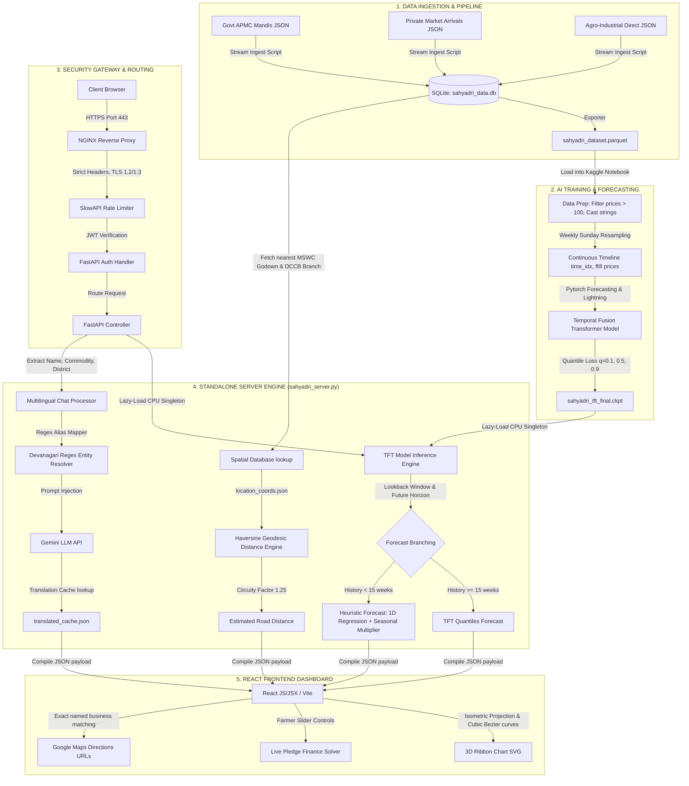
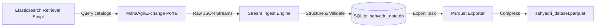
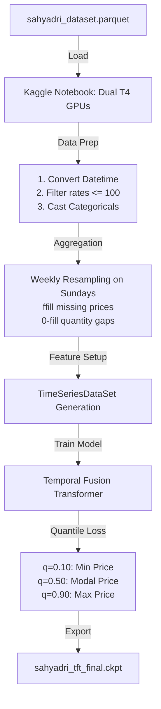
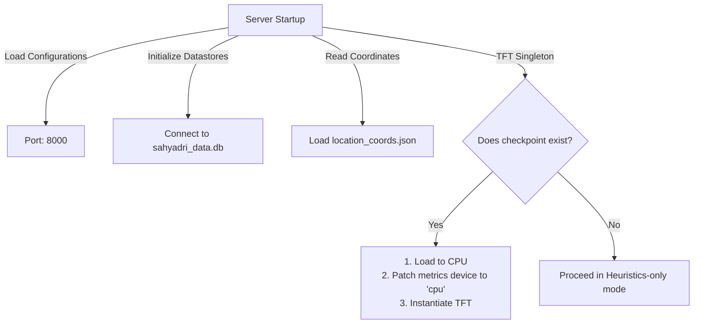
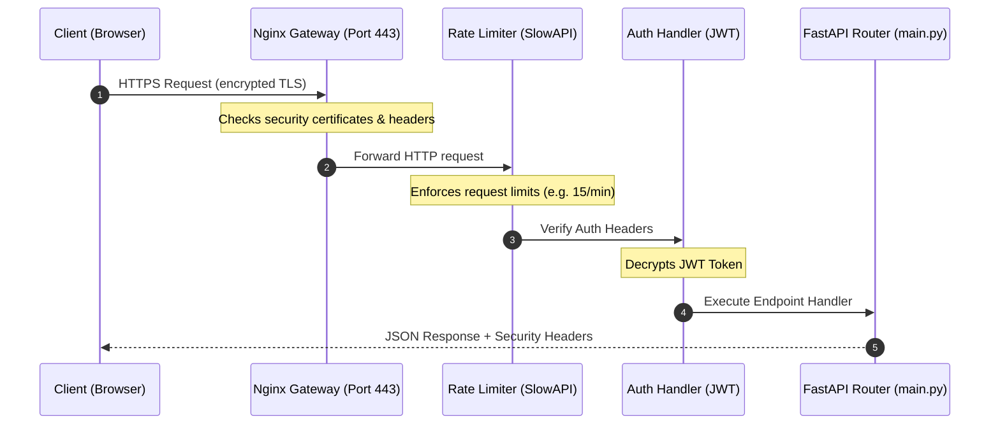
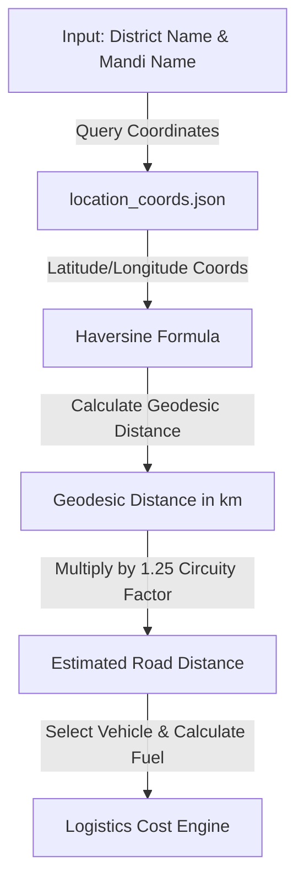
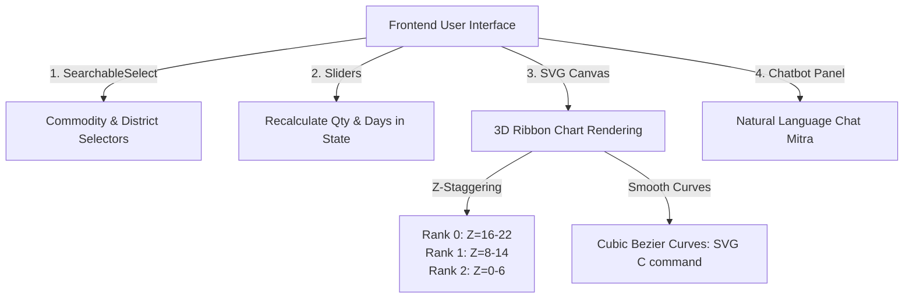

# Project Sahyadri 2.0: Master Presentation & Technical Demo Report

Welcome to the **Master Presentation & Technical Demo Report** for **Project Sahyadri 2.0**. This document serves as a slide-by-slide technical explainer and presentation script. It balances **simple, intuitive analogies** (so simple a 5-6 year old can grasp the concepts) with **extreme technical details** (libraries, math formulas, schemas, and configurations) for the examination panel.

---

## Overall System Architecture Flowchart

Below is the native Mermaid diagram illustrating the end-to-end data flow, AI training, security routing, backend calculations, and frontend rendering of the Sahyadri platform:



---

## ── STAGE 1: Data Ingestion & Storage ──

### 👶 Simple Analogy: "The Shopping Cart"
> Imagine you want to bake a giant cake. Before you start mixing ingredients, you must go to different stores and buy milk, flour, sugar, and eggs. 
> 
> In our project, the "cake" is the final price recommendation, and the "ingredients" are the raw files detailing prices, warehouses, banks, and soil laboratories from different sources.

### 📊 Diagrammatic Workflow


### ⚙️ Minute Technical Details
1. **Raw Retrieval:** We executed an Elasticsearch script to query raw JSON transaction lists from the **MahaAgriExchange (MahaAgX)** data portals.
2. **The 8 Core Datasets:**
   * *Daily APMC Market Arrivals & Prices* (ID: `09739e2a-d809-11f0-b972-af914ab1614f`)
   * *Private Market Daily Arrivals & Prices* (ID: `474b0c02-cfb8-4a33-8d6e-2f419a0c847e`)
   * *Agro-Industrial Direct Commodity Transactions* (ID: `7676296a-2d0c-4abb-b7db-a366795e8bb6`)
   * *MSWC Commodity Warehouses* (ID: `8bad4a9a-0572-4ae1-98d8-ebc04e0f0e6b`)
   * *Agristack Bank Branches Registry* (ID: `6555aa5e-e473-439c-8cde-70886e4fc073`)
   * *Agristack Cooperative Society Branches (DCCB)* (ID: `e13a1097-87c7-4ca0-bde5-d07a9f1a74aa`)
   * *Agristack Registry of Krishi Vigyan Kendras (KVK)* (ID: `2a9806ea-e132-4286-a734-ff3e75cafe9a`)
   * *Agristack Soil Testing Laboratory Registry* (ID: `790ac3c2-9c5f-43e4-a58e-8456b7336eeb`)
3. **Database Schema:** We structured these streams and loaded them into [sahyadri_data.db](file:///c:/Users/Shashank/OneDrive/Desktop/data_sets_fetched/market_and_transaction_data/sahyadri_data.db). The core `market_transactions` schema contains:
   * `date` (TEXT), `commodity` (TEXT), `district` (TEXT), `source_type` (TEXT: APMC/PRIVATE/AGRO_INDUSTRIAL), `market_name` (TEXT).
   * `modal_price` (NUMERIC), `min_price` (NUMERIC), `max_price` (NUMERIC), `quantity` (NUMERIC), `variety` (TEXT).
4. **Parquet Compression:** We compiled the raw SQLite dataset into a column-oriented `sahyadri_dataset.parquet` file (3,100,000+ rows) to maximize IO performance during ML model training.

---

## ── STAGE 2: AI Price Forecasting (TFT Model) ──

### 👶 Simple Analogy: "The Smart Weather Robot"
> Imagine a smart robot that sits by a window. It writes down the weather every day for years. Because it has seen so many rainy and sunny days, when you show it today's weather, it can guess what the weather will look like next week.
> 
> The **Temporal Fusion Transformer (TFT)** is that smart robot, but instead of weather, it remembers historical crop prices and guesses what the price will be next week!

### 📊 Diagrammatic Workflow


### ⚙️ Minute Technical Details
1. **Training Libraries:** Built using **PyTorch** (`torch`), **PyTorch Lightning** (`lightning.pytorch`), and **PyTorch Forecasting** (`pytorch_forecasting`).
2. **Data Cleansing:** Implements timestamp casting, drops records where `modal_price <= 100` (filtering out corrupt data), and casts text categories into string-level category keys to prevent indexing errors in Pandas.
3. **Weekly Sunday Resampling Math:** Converts transaction dates into Sunday weekly bounds:
   $$\text{week\_date} = \text{date} + ((6 - \text{weekday}) \bmod 7)\text{ days}$$
   Gaps are forward-filled (`ffill`) for prices and zero-filled (`0.0`) for transaction quantities. Sequences shorter than 15 weeks are filtered out.
4. **TFT Features Mapping:**
   * **Static Categoricals:** `commodity`, `district`, `source_type`, `market_name` (compiled as static entity embeddings).
   * **Time-Varying Known Categoricals:** `month` (captures cyclical seasonality).
   * **Time-Varying Known Reals:** `time_idx` (linear elapsed timeline index).
   * **Time-Varying Unknown Reals:** `modal_price` (target), `quantity` (trade volume), `volatility_4w` (rolling 4-week standard deviation of price).
5. **Hyperparameters:** Lookback window (Encoder Length) set to **12 weeks**, forecast horizon (Decoder Length) set to **4 weeks** (30 days). Optimized with the Ranger optimizer (learning rate = `0.03`, dropout = `0.15`), and softplus transformation normalizers.
6. **Quantile Outputs:** Trained using `QuantileLoss([0.1, 0.5, 0.9])`, outputting minimum, modal, and maximum price boundaries.

---

## ── STAGE 3: Standalone Server Engine (sahyadri_server.py) ──

### 👶 Simple Analogy: "The Standby Backup Engine"
> Imagine a large ship that has a main engine but also carries a compact backup engine. If the main engine room is undergoing repairs, the captain can switch on the backup engine to keep the ship moving.
> 
> The [sahyadri_server.py](file:///c:/Users/Shashank/OneDrive/Desktop/data_sets_fetched/market_and_transaction_data/sahyadri_server.py) file is a standalone, single-file server that runs the entire website, the AI model, the database, and the chatbot all by itself without needing external servers.

### 📊 Diagrammatic Workflow


### ⚙️ Minute Technical Details
1. **Model Loading:** Implements dynamic lazy-loading for the TFT checkpoint model (`sahyadri_tft_final.ckpt`) inside [sahyadri_server.py](file:///c:/Users/Shashank/OneDrive/Desktop/data_sets_fetched/market_and_transaction_data/sahyadri_server.py).
2. **CPU Thread Clamping:** Forces PyTorch CPU threads to 1 to avoid thread pool thrashing and high CPU utilization on Uvicorn instances:
   ```python
   torch.set_num_threads(1)
   torch.set_num_interop_threads(1)
   ```
3. **GPU-to-CPU Device Patching:** Modifies the compiled checkpoint's internal device hooks to enable CPU execution:
   ```python
   checkpoint = torch.load(TFT_CHECKPOINT, map_location="cpu")
   checkpoint["hyper_parameters"]["loss"]._device = torch.device("cpu")
   for metric in checkpoint["hyper_parameters"]["logging_metrics"]:
       metric._device = torch.device("cpu")
   ```
4. **Heuristic Fallback:** If lookback steps are insufficient (<15 weeks), the server calculates a trend line using `numpy.polyfit` over the past 90 days:
   $$\text{Price}_D = \text{Spot Price} + \left( \text{Slope} \times \frac{D}{2} \right)$$
   This is combined with a monthly crop-specific harvest seasonality multiplier (-7% price dip during peak harvest, +10% increase during off-season).

---

## ── STAGE 4: Request Routing & FastAPI REST Security ──

### 👶 Simple Analogy: "The Gate Guard & Visitor Log"
> Imagine a bank with a security guard standing at the front door. The guard checks your ID, prevents too many people from entering at once so the lobby isn't crowded, and writes down your name in a book.
> 
> Our security layer does this: **Nginx** is the guard at the gate, **SlowAPI** prevents hackers from flooding the server, and **JWT Tokens** act as digital secure passes.

### 📊 Diagrammatic Workflow


### ⚙️ Minute Technical Details
1. **Nginx Proxy (`nginx.conf`):**
   * Redirection: Redirects incoming Port 80 (HTTP) calls to secure Port 443 (HTTPS).
   * SSL Configuration: Loads `sahyadri.crt` and `sahyadri.key`, restricting negotiation to **TLSv1.2** and **TLSv1.3**.
   * Header Security: Sets HSTS (`max-age=63072000`), X-Frame-Options (`DENY`), Content-Security-Policy (CSP), and masks server headers (removing `Server` and `X-Powered-By`).
2. **FastAPI Server (`main.py`):**
   * **SlowAPI Rate Limiter:** Protects endpoints from DDoS attacks by limiting requests per client IP (e.g. `/api/chat` is capped at 15 requests/minute).
   * **JWT Authentication:** Binds access to a custom JSON Web Token verification handler (`get_current_user` dependencies via `jose` and `bcrypt`).
   * **Tracing & Telemetry:** Injects request tracking IDs into response headers:
     * `X-Request-ID` (UUID trace token)
     * `X-Process-Time` (process execution duration timer)

---

## ── STAGE 5: The Spatial Distance & Routing Engine ──

### 👶 Simple Analogy: "The Winding Road Map"
> If you look at a map, a bird flies in a straight line. But you cannot drive a truck in a straight line; roads curve, wind around hills, and cross bridges.
> 
> Our system calculates the straight-line distance using a math formula (**Haversine**) and then multiplies it by a **1.25 winding factor** to estimate real road travel distance.

### 📊 Diagrammatic Workflow


### ⚙️ Minute Technical Details
1. **Haversine Distance Equation:** Calculates geodesic distance on a spherical plane:
   $$d = 2R \arcsin\left(\sqrt{\sin^2\left(\frac{\Delta \phi}{2}\right) + \cos(\phi_1)\cos(\phi_2)\sin^2\left(\frac{\Delta \lambda}{2}\right)}\right)$$
   * Where $\phi_1, \phi_2$ are latitudes, $\lambda_1, \lambda_2$ are longitudes, and $R = 6371.0\text{ km}$ (Earth's radius).
2. **Winding Multiplier:** Geodesic results are multiplied by a circuity coefficient of **1.25** to estimate realistic road driving kilometers.
3. **Google Maps Search String Construction:** Maps links are built using exact destination business names to force Google Maps to search the named directory instead of dropping a generic pin on raw coordinates:
   * APMCs: `f"APMC Market {market_name}, {district_name}, Maharashtra, India"`
   * Warehouses: `f"MSWC Warehouse {plant_name}, {address}, Maharashtra, India"`

---

## ── STAGE 6: The Frontend User Interface ──

### 👶 Simple Analogy: "The Spaceship Dashboard"
> You don't pilot a spaceship by looking at raw wires and hot engines. You look at a screen showing buttons, switches, and glowing lines.
> 
> Our **React Frontend** is the spaceship dashboard for the farmer, rendering complex numbers into interactive sliders, calendars, and glowing 3D paths.

### 📊 Diagrammatic Workflow


### ⚙️ Minute Technical Details
1. **Technology Stack:** Built using **HTML5**, **Vanilla CSS**, and **React JS/JSX** compiled with the **Vite** bundler.
2. **Multilingual Regex Input Matching:** Resolves user query entities using boundaries (`\b` for ASCII, custom negative lookarounds/lookbehinds for Devanagari text):
   ```python
   # Example: Matches 'कापूस' or 'KAPUS' boundary-isolated in chat string
   pattern = r'(?<![A-Z0-9])' + re.escape(alias_upper) + r'(?![A-Z0-9])'
   ```
3. **3D Ribbon Projections:** Uses isometric trigonometry:
   $$px = 75 + x \cos(12^\circ) + z \cos(-22^\circ), \quad py = 155 - y + x \sin(12^\circ) + z \sin(-22^\circ)$$
4. **Smooth Volumetric Shapes:** SVG curves are plotted using cubic Bezier curves (`C` commands). Ribbons are staggered along the depth axis by rank to prevent overlapping and are rendered from back-to-front (Rank 2 first, Rank 0 last).
5. **Live Sliders recalculator:** State listeners instantly recalculate storage rent and interest rates on the client side without triggering API calls, providing real-time responsiveness.
