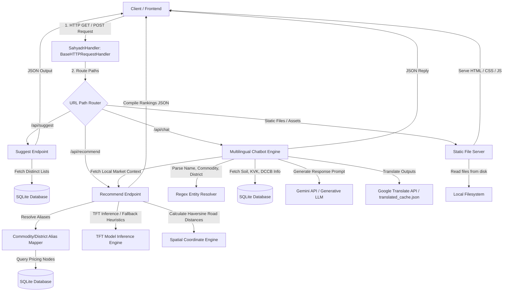

# Project Sahyadri 2.0: Standalone Server Architecture (sahyadri_server.py)

This document details the architecture, request life cycle, and inner workings of [sahyadri_server.py](file:///c:/Users/Shashank/OneDrive/Desktop/data_sets_fetched/market_and_transaction_data/sahyadri_server.py). It serves as a unified, single-file lightweight Python server implementing REST APIs, a multilingual chatbot engine, and local deep-learning inference.

---

## 1. Request Life Cycle & Architectural Flow

The diagram below illustrates the end-to-end request life cycle in [sahyadri_server.py](file:///c:/Users/Shashank/OneDrive/Desktop/data_sets_fetched/market_and_transaction_data/sahyadri_server.py):



---

## 2. Core Server Components

### 2.1 The Request Handler (`SahyadriHandler`)
Unlike framework-driven servers, [sahyadri_server.py](file:///c:/Users/Shashank/OneDrive/Desktop/data_sets_fetched/market_and_transaction_data/sahyadri_server.py) extends Python's native `http.server.BaseHTTPRequestHandler`. 
* **Routing Strategy:** Implements `do_GET()` and `do_POST()` handlers to inspect incoming URI path strings and route execution manually.
* **CORS Management:** Prepends standard Access-Control headers to support cross-origin browser requests during development:
  ```python
  self.send_header("Access-Control-Allow-Origin", "*")
  ```

---

## 3. Data Processing & Spatial Logic

### 3.1 Multilingual Entity Alias Mapping
To handle inputs in English and Devanagari script, the server utilizes mapping tables:
* **Commodity Alias Table:** Standardizes input terms (e.g., `सोयाबीन`, `Mug`, `Soybean`, `Soya`) to their canonical database keys (e.g., `SOYABEAN`, `GREEN GRAM`).
* **District Alias Table:** Maps local spellings and spelling changes (e.g., `Osmanabad` $\rightarrow$ `DHARASHIV`, `Aurangabad` $\rightarrow$ `CHHATRAPATI SAMBHAJINAGAR`).

### 3.2 Haversine Road Distance Calculation
If exact coordinates are missing, the server performs spatial math:
1. Looks up the latitude/longitude coordinate of the source and target location from [location_coords.json](file:///c:/Users/Shashank/OneDrive/Desktop/data_sets_fetched/market_and_transaction_data/location_coords.json), falling back to district center parameters.
2. Computes the geodesic distance using the **Haversine formula**:
   $$d = 2R \arcsin\left(\sqrt{\sin^2\left(\frac{\Delta \phi}{2}\right) + \cos(\phi_1)\cos(\phi_2)\sin^2\left(\frac{\Delta \lambda}{2}\right)}\right)$$
3. Multiplies the result by a **circuity factor of 1.25** to estimate actual road travel distance.

---

## 4. Intelligent Forecasting Workflow

When calculating recommendations, `sahyadri_server.py` queries the database for active nodes:
1. **Local Node Search:** Searches for up to 3 local nodes (APMC mandis, private markets, corporate buyers) in the target district.
2. **State Fallback Top-Up:** If fewer than 3 nodes are active in the target district, it queries neighboring districts to fetch competitive fallback nodes.
3. **Forecasting Branching:**
   * **Branch A (TFT Deep Learning):** Loads the PyTorch model checkpoint from `sahyadri_trained_model[TFT_MODEL]/` on the CPU, formats the historical transactions into a weekly resampled dataframe, constructs the 4-week future horizon, and runs inference.
   * **Branch B (Heuristic Fallback):** If there are fewer than 15 historical data points for the node, it calculates a 1D linear regression slope over the spot price history and multiplies it by a seasonal harvest coefficient (-7% price dip during peak harvest, +10% increase during off-season).

---

## 5. Multilingual Chatbot Agent (`/api/chat`)

The `/api/chat` endpoint parses natural language queries and builds an context-rich prompt for Generative AI (Gemini):

```
       +---------------------------------------------+
       |           Farmer Input Query                |
       |  (e.g., "माझे नाव राम आहे. कापूस कुठे विकू?")  |
       +----------------------+----------------------+
                              |
                              v
       +---------------------------------------------+
       |           Entity Extraction (Regex)         |
       |       Name: "राम", Commodity: "COTTON"      |
       +----------------------+----------------------+
                              |
                              v
       +---------------------------------------------+
       |          Market Intelligence Fetch          |
       |  Calls calculate_forecasts() for Cotton     |
       |  Queries closest MSWC Warehouse & DCCB Bank |
       +----------------------+----------------------+
                              |
                              v
       +---------------------------------------------+
       |          Dynamic Prompt Synthesis           |
       |  Fuses user profile, pricing forecasts,     |
       |  storage rents, and local credit advances.  |
       +----------------------+----------------------+
                              |
                              v
       +---------------------------------------------+
       |              Gemini LLM Call                |
       |  Generates highly localized answer advice.   |
       +----------------------+----------------------+
```

### 5.1 Localized Response Generation
* **Name & Profile Memory:** Extracts user names (e.g., "Ram") and maintains a friendly conversation persona.
* **Translation Cache (`translated_cache.json`):** Saves API translation latency by storing common agricultural terms and responses locally, providing sub-millisecond translation lookups for repetitive queries.
