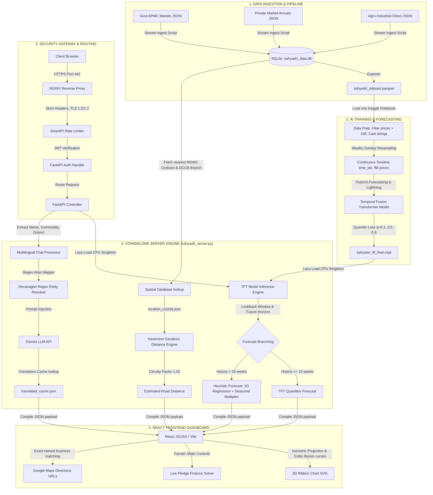

# Project Sahyadri 2.0: System Architecture Overview

This document provides a high-level overview of the entire Project Sahyadri 2.0 architecture, detailing the data flow from ingestion to frontend visualization, the AI forecasting mechanics, and the spatial routing subsystem.

---

## 1. System Architecture Diagram

Below is the native Mermaid flowchart illustrating the end-to-end Project Sahyadri 2.0 system architecture:

---

## 2. Component Breakdowns & Workflows

### 2.1 Raw Data Channels & Pipeline Storage
* **Data Sources:** Raw JSON transactions are fetched dynamically from the **MahaAgriExchange (MahaAgX)** portal. This includes:
  * Government APMC Mandis transactions.
  * Private Market Arrivals.
  * Agro-Industrial Direct Corporate procurement records.
* **Storage Ingestion:** Raw JSON arrays are structured and inserted into the central SQLite database [sahyadri_data.db](file:///c:/Users/Shashank/OneDrive/Desktop/data_sets_fetched/market_and_transaction_data/sahyadri_data.db) under the `market_transactions` table.
* **Dataset Export:** To facilitate machine learning training on Kaggle/Colab, the data is exported into a compressed Parquet format `sahyadri_dataset.parquet` to ensure high-speed tensor loads.

### 2.2 AI Training & TFT Forecasting Inference
1. **Model Training:** The `sahyadri_dataset.parquet` dataset is ingested by a Kaggle/Colab notebook using GPU accelerators (Tesla T4 x2) to train the **Temporal Fusion Transformer (TFT)** model.
2. **Checkpoint Deployment:** The best weights are saved in a compiled checkpoint directory [sahyadri_trained_model[TFT_MODEL]/](file:///c:/Users/Shashank/OneDrive/Desktop/data_sets_fetched/market_and_transaction_data/sahyadri_trained_model[TFT_MODEL]) as `sahyadri_tft_final.ckpt`.
3. **Data Fetching for Forecasts:** When a query is initiated, the server fetches the historical transaction sequence for the selected market from the database:
   * **Weekly Resampling:** Daily transaction data is resampled to Sundays (using mean prices, minimum/maximum prices, and total quantities).
   * **Gap Handling:** Price gaps are forward-filled (`ffill`), and volume gaps are zero-filled (`0.0`).
   * **Lookback Padding:** The sequence is padded with a 12-week historical lookback (Encoder) and a 4-week future horizon (Decoder).
4. **Quantiles Prediction:** The model runs a forward CPU pass to predict three quantiles for the next 30 days:
   * **10th Percentile ($q=0.10$):** Minimum price boundary (worst-case).
   * **50th Percentile ($q=0.50$):** Modal price (most likely).
   * **90th Percentile ($q=0.90$):** Maximum price boundary (best-case).
5. **Linear + Seasonal Fallback:** If a market has insufficient history (<15 weeks), the server executes a fallback forecast using a 1D linear regression trend combined with crop-specific harvest seasonality coefficients (-7% during harvest peaks, +10% off-season).

### 2.3 Standalone Backend Server (sahyadri_server.py)
The Python server coordinates incoming API queries and executes spatial calculations:
* **Reads Coordinates:** Resolves coordinates for districts and mandis from [location_coords.json](file:///c:/Users/Shashank/OneDrive/Desktop/data_sets_fetched/market_and_transaction_data/location_coords.json).
* **Calculates Routes:** Uses the **Haversine Distance Engine** to calculate geodesic distance, multiplying by a circuity factor of **1.25** to estimate actual road travel distance in kilometers.
* **Extracts Entities:** Utilizes Devanagari and English regex patterns inside the Multilingual Chat Processor to identify names, crops, and districts from natural language questions.
* **Integrates Google Maps URLs:** Generates navigation URLs using exact business names (e.g., `APMC Market Nanded` or `MSWC Warehouse Udgir`) to ensure Google Maps routes to the exact physical business listing rather than a generic pin coordinate.

### 2.4 Frontend User Interface
* **Interactive Chat Mitra:** Renders a chat interface with dynamic crop recommendations and built-in AI safety disclaimers.
* **Interactive Dashboard:** Includes searchable filter dropdowns, crop seasonality calendars, and a pledge finance calculator.
* **3D Ribbon Chart:** Uses isometric projection coordinates and cubic Bezier curves to render price forecast trajectories dynamically in SVG.
